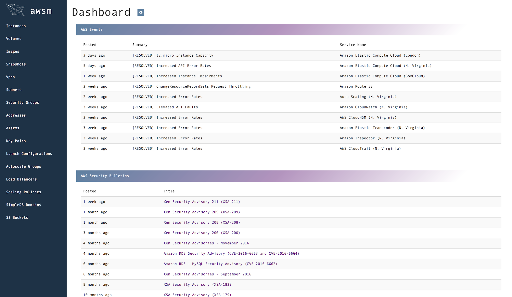
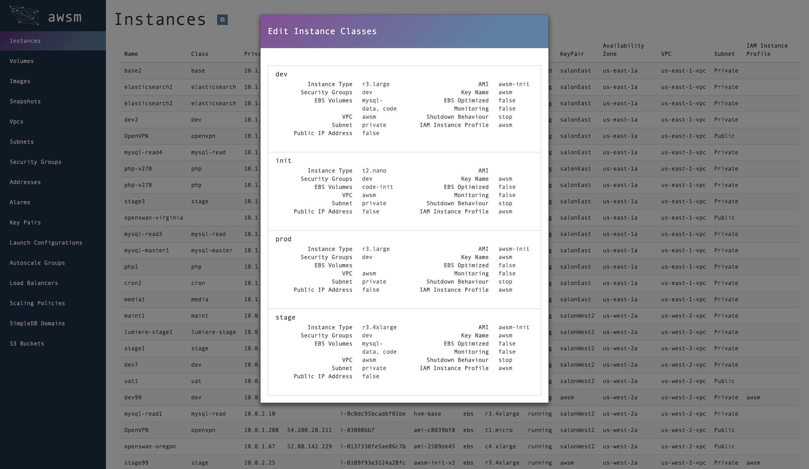
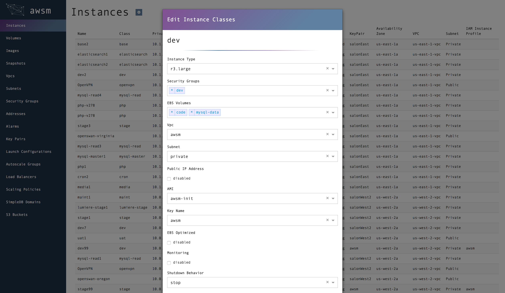

# awsmDashboard
> GopherJS/React front-end for [awsm](https://github.com/murdinc/awsm)

#### Note: This is a fairly fresh implementation of the awsm dashboard, but it is being developed heavily and an initial release will be available shortly. Contributions are welcome!

## Dashboard

## Asset Tables

## Classes

## Class Forms

